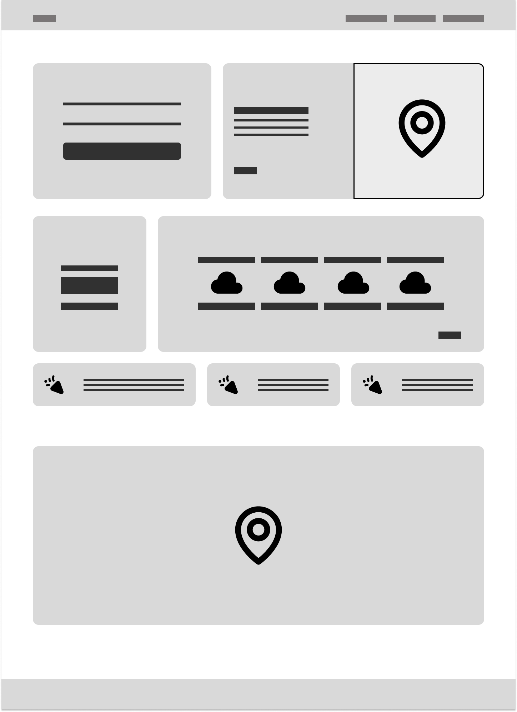
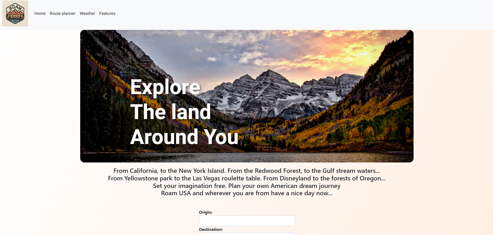
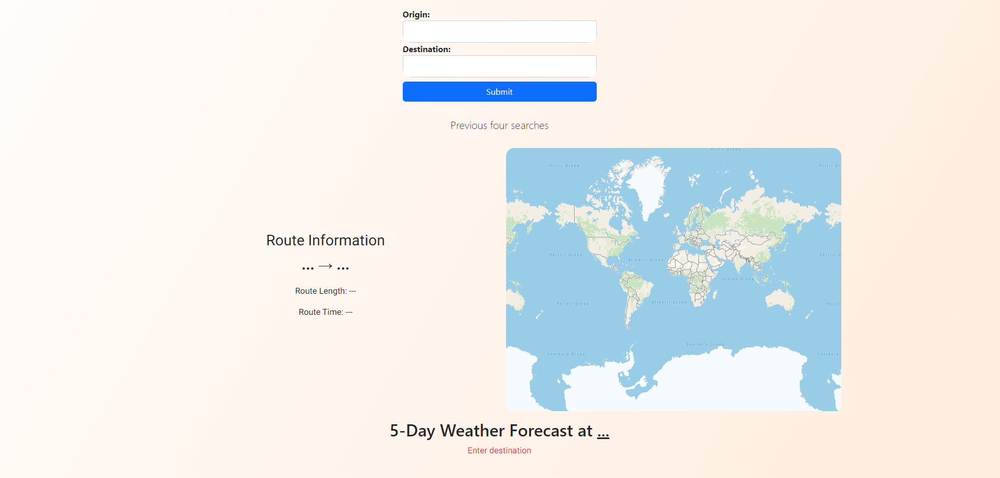
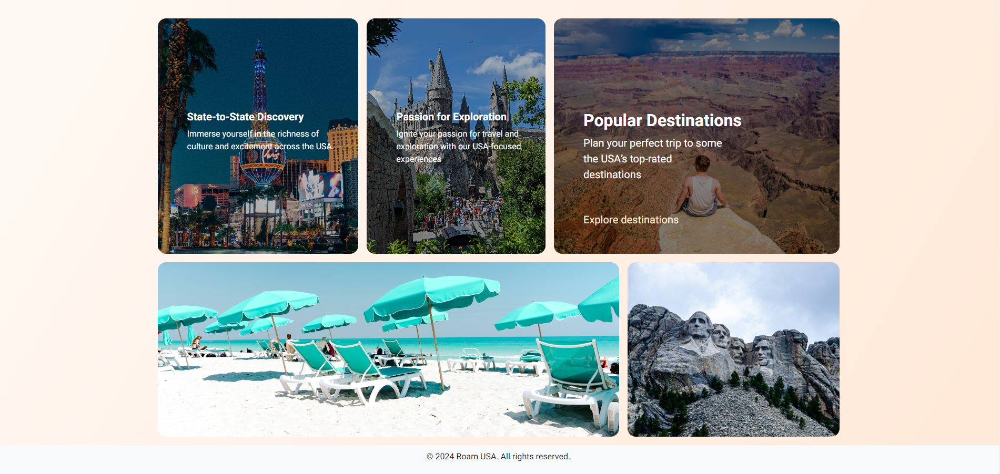

# Project-DSB

Roam USA is a Travel Planner developed with HTML, CSS, Bootstrap5 components and with Weather and Route APIs.

## Roam USA

Roam USA is the name of the website. The function of the site will allow the end user to plan a route or multiple routes across North America. It will also show what kind of weather the user can expect at their destination.

## Collaborators

This project was created by:
* Dan Joyce (Team Leader) 
* Raymond Chibvongodze
* Roberts Feldmanis 
* Vicky Cowell

## User story
```md
The user wants a website that will show them how long it will take to travel between locations within North America. They also want to be able to see what the weather will be like at their destination.
```

## Layout of Project

Below is the wireframe Raymond created of the basic layout of the site and how we agreed as a team that we want it to look. Although some changes were required we used this as a foundation. 



## Design
We wanted an on-trend, simple and functional Apple-style, bento-box design with an earthy, peachy-red/orange colour scheme to echo the colours of the North American landscape -its canyons and mountains. 

## APIs used:

* Google fonts API with Heebo text
* TomTom maps API -displays route in map and provides the distance and time it takes to travel 
* Openweather API -to provide 5 day forecast for destination

## Screenshots







## Gif video of Application working 
Here is a video of the Application working with the search function.


## Directions for future development:

* To show points of interest, events or services along the chosen route
* To show the weather along the route not only at the destination
* To show hotels, hostels, b&Bs and accomodation along the route/ways to book 

## Links to Repo

https://github.com/iamdanjoyce/Project-DSB

## Deployed website

https://iamdanjoyce.github.io/Project-DSB/

## Comments

images from unsplash

https://unsplash.com/photos/white-concrete-building-on-top-of-mountain-during-sunset-6QDvwq2Fjsc?utm_content=creditShareLink&utm_medium=referral&utm_source=unsplash

https://unsplash.com/photos/taxi-cabs-loading-on-road-between-high-rise-buildung-s6L0uQyprpE

