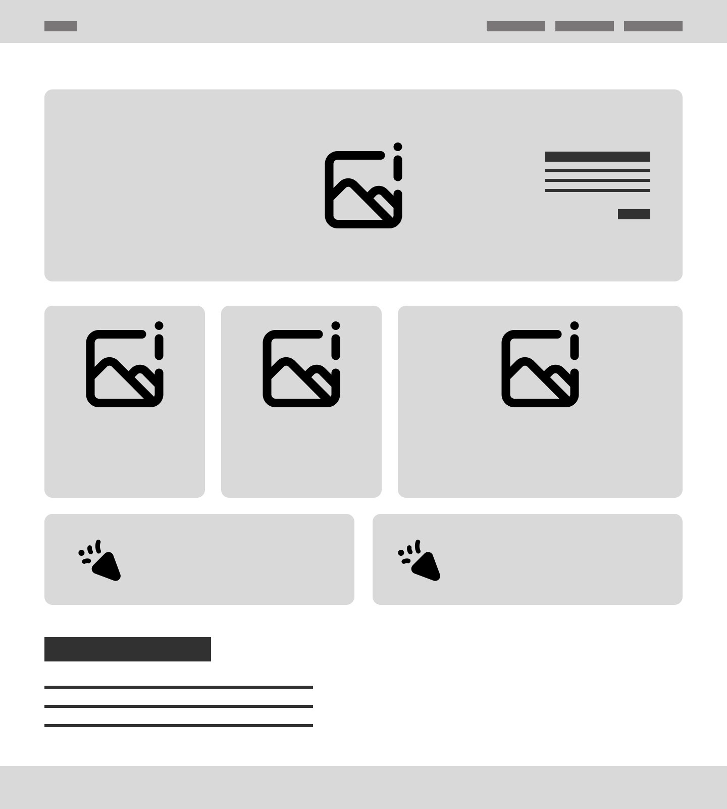

# Project-DSB

Roam USA is a Travel Planner developed with HTML, CSS, Bootstrap5 components and with Weather and Route APIs.

## Roam USA

Roam USA is the name of the site. The function of the website will allow the end user to plan a route across America. It will also show what kind of weather to expect at their destination.

## Collaborators

This project was created by Dan Joyce (Team Leader) Raymond Chibvongodze, Roberts Feldmanis and Vicky Cowell. 

## User story
```md
The user wants a website that will show them how long it will take to travel across America. They also want to be able to see what the weather will be like on those days of travelling.
```

## Layout of Project

Below is the wireframe Raymond created of the basic layout of the site and how we agreed as a team that we want it to look.



## APIs used

Google fonts API with Heebo text
TomTom maps API
Openweather API

## Screenshots 
Here is a video of the Application working with the search function.

<video src="./Assets/images/Screen Recording Roam USA.mp4" controls="controls" style="max-width: 1200px;">
</video>

## Links to Repo

https://github.com/iamdanjoyce/Project-DSB

## Comments

images from unsplash
https://unsplash.com/photos/white-concrete-building-on-top-of-mountain-during-sunset-6QDvwq2Fjsc?utm_content=creditShareLink&utm_medium=referral&utm_source=unsplash
https://unsplash.com/photos/taxi-cabs-loading-on-road-between-high-rise-buildung-s6L0uQyprpE

